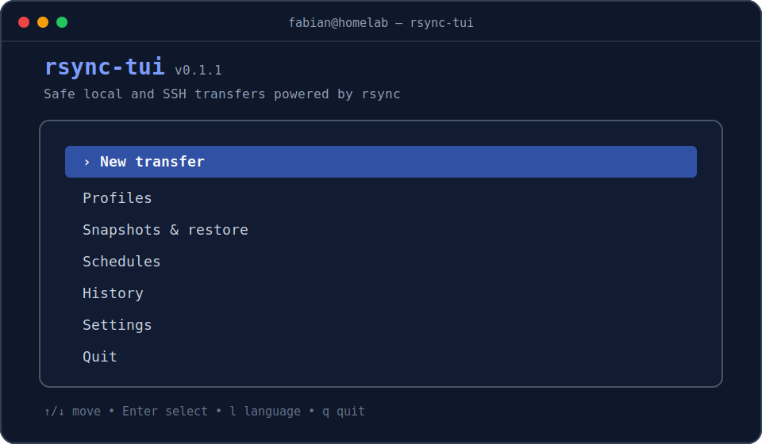

# rsync-tui

`rsync-tui` ist eine moderne, zweisprachige Terminaloberfläche für sichere
lokale und SSH-Übertragungen mit `rsync`. Sie richtet sich besonders an
Raspberry Pi, OpenMediaVault, Debian-/Ubuntu-Server, USB-Speicher und Homelabs.

> `v0.1.3` ist eine Beta. Vor Mirror- oder Move-Vorgängen immer den angezeigten
> Befehl prüfen und den vorausgewählten Trockenlauf verwenden.

[English documentation](README.md)



## Funktionen

- Moderne, responsive Bubble-Tea-TUI mit Tastatur- und Mausbedienung
- Responsives Material-3-Dashboard mit Karten, Stepper und Statusflächen
- Deutsche und englische Oberfläche mit automatischer Spracherkennung
- Beliebige lokale Pfade statt fester `/srv`-Bindung
- Lokaler und entfernter Verzeichnisbrowser über `Ctrl+B`
- SSH-Push/Pull mit OpenSSH-Schlüsseln, Agent oder nativem Passwortdialog
- Kopieren, Spiegeln, Verschieben, Snapshots, Wiederherstellen und Expertenmodus
- Einmalige TUI- und CLI-Übertragungen ohne gespeichertes Profil
- Vollständige Befehlsvorschau ohne lokale Shell-Auswertung
- XDG-konforme TOML-Profile, Verlauf und Logs
- `--link-dest`-Snapshots mit Last-N- oder GFS-Aufbewahrung
- systemd-Zeitpläne mit Sicherheitsgrenzen
- ntfy, Gotify, Webhook, Sendmail und SMTP/TLS
- Signierte automatische Updates mit Rollback

## Voraussetzungen

- Linux auf amd64, arm64 oder armv7
- rsync ab Version 3.1.0
- OpenSSH-Client für entfernte Übertragungen
- systemd nur für Zeitpläne und automatische Hintergrundupdates
- `sudo` nur bei ausdrücklich erhöht ausgeführten Profilen

## Installation

Installationsskript herunterladen, prüfen und ausführen:

```bash
curl -fLO https://raw.githubusercontent.com/fabianschmeltzer/rsync-tui/main/install.sh
less install.sh
sh install.sh
```

Als Root installiert das Skript standardmäßig nach
`/usr/local/bin/rsync-tui`, sonst nach `~/.local/bin/rsync-tui`. Falls das
Benutzerverzeichnis noch nicht im `PATH` steht, ergänzt das Skript
`~/.profile`; die Änderung gilt ab der nächsten Shell. Standardmäßig wird die
neueste veröffentlichte Version einschließlich Vorabversionen installiert.
Eine bestimmte Version kann weiterhin mit `VERSION=v0.1.3 sh install.sh`
ausgewählt werden. Danach:

```bash
rsync-tui doctor
rsync-tui
```

## Bedienung

Quelle und Ziel können lokal oder per SSH angegeben werden:

```text
/srv/dev-disk-by-uuid-.../daten
backup@server:/srv/backups/daten
ssh://backup@server:2222/srv/backups/daten
```

`Ctrl+B` öffnet im Quell- oder Zielfeld den Verzeichnisbrowser. Die Auswahl
„Inhalt“ gegenüber „Verzeichnis“ macht die bei rsync wichtige Bedeutung des
abschließenden Schrägstrichs sichtbar.

CLI:

```text
rsync-tui
rsync-tui run --profile <id|name> [--dry-run] [--scheduled]
rsync-tui run --source <pfad> --destination <pfad> [--mode copy|mirror|move]
rsync-tui profile list|show|configure
rsync-tui notify test --profile <id|name>
rsync-tui snapshot list --profile <id|name>
rsync-tui snapshot restore --profile <id|name> --snapshot <id>
rsync-tui doctor [--json]
rsync-tui schedule install --profile <id|name>
rsync-tui update [--check|--rollback]
rsync-tui version [--json]
```

Bei einer einmaligen CLI-Übertragung ist `--name` optional;
`--source-semantics contents|directory` steuert den abschließenden Schrägstrich.
Einmalige Mirror- und Move-Läufe bleiben Trockenläufe, solange nicht gemeinsam
`--execute --yes` angegeben wird. Direkte Übertragungen können nicht geplant
werden.

Profile liegen unter `~/.config/rsync-tui/profiles/`, Verlauf und Logs unter
`~/.local/state/rsync-tui/`.

Das Prüfintervall in den Einstellungen bietet zusätzlich **Jeden Start**.
Diese Auswahl gilt nur beim Start der TUI und bleibt ohne automatische Updates
wirkungslos.

### Erscheinungsbild

Standardmäßig verwendet die Oberfläche Material Dunkel mit Indigo-Akzent. In
den Einstellungen stehen Material Dunkel, Material Hell, Mitternacht, Hoher
Kontrast und Ohne Farben, sieben Akzentpaletten, komfortable oder kompakte
Dichte, Unicode- oder optionale Nerd-Font-Symbole sowie keine, dezente oder
ausdrucksstarke Bewegung zur Auswahl. `NO_COLOR` deaktiviert ANSI-Styling,
ohne die gespeicherte Auswahl zu überschreiben.

## Sicherheit

- Identische und gefährlich überlappende Pfade werden abgelehnt.
- Mirror und Move starten standardmäßig als Trockenlauf.
- Ein Überspringen des Trockenlaufs verlangt zwei Bestätigungen.
- Unbeaufsichtigte Lösch-/Move-Läufe benötigen Freigabe, Pflichtvorschau und
  numerische Grenzen.
- Geplante SSH-Jobs benötigen eine nichtinteraktive Schlüsselanmeldung.
- SSH-Passwörter und private Schlüssel werden nie durch `rsync-tui` gespeichert.
- Snapshot-Bereinigung läuft erst nach erfolgreichem Backup und behält immer
  mindestens den neuesten erfolgreichen Stand.

Standardmäßig bleiben die letzten zehn Snapshots erhalten. Alternativ kann GFS
mit sieben täglichen, vier wöchentlichen und zwölf monatlichen Ständen gewählt
werden.

## Entwicklung

```bash
go test ./...
go vet ./...
go build -o bin/rsync-tui ./cmd/rsync-tui
```

Nicht Bestandteil von `v0.1.3` sind rsync-Daemonverwaltung,
bidirektionale Synchronisation, Remote-zu-Remote und Windows/macOS.

Das frühere Whiptail-Skript liegt als nicht mehr unterstützte Referenz unter
[`legacy/`](legacy/).

## Lizenz

MIT, siehe [LICENSE](LICENSE).
